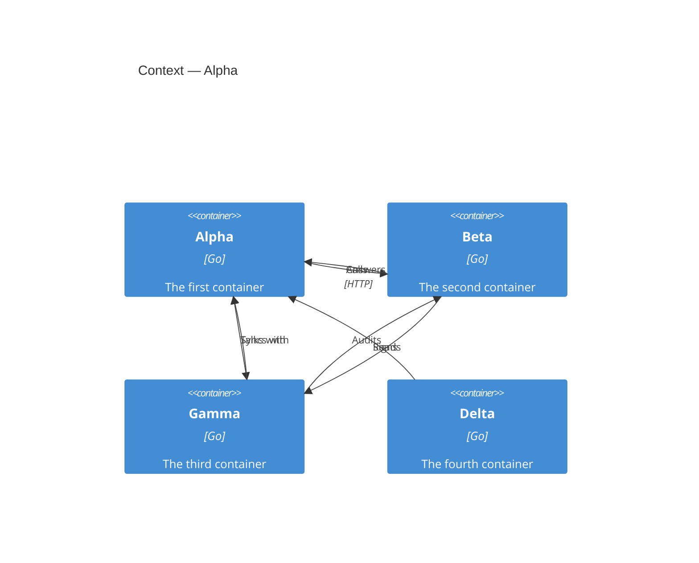

# Alpha

## Context

```mermaid
C4Container
    title Context — Alpha
    Container(a, "Alpha", "Go", "The first container")
    Container(b, "Beta", "Go", "The second container")
    Container(g, "Gamma", "Go", "The third container")
    Container(d, "Delta", "Go", "The fourth container")
    BiRel(a, g, "Talks with")
    Rel(a, b, "Calls", "HTTP", "Sends requests", $tags="contract:contract-good")
    Rel_Back(b, a, "Calls again")
    Rel(b, a, "Answers")
    Rel(g, a, "Syncs with", $tags="sync+async")
    Rel(g, b, "Signs", $tags="contract:contract-missing")
    Rel(b, g, "Reads", $tags="contract:contract-good")
    Rel(d, a, "Audits", $tags="async,audited")
```
