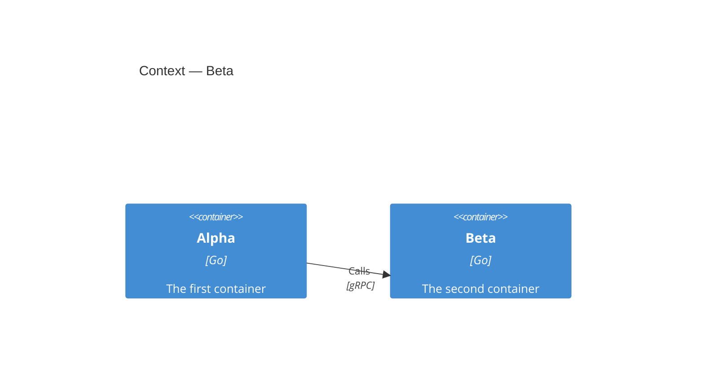

# Beta

## Context

```mermaid
C4Container
    title Context — Beta
    Container(a, "Alpha", "Go", "The first container")
    Container(b, "Beta", "Go", "The second container")
    Rel(a, b, "Calls", "gRPC", "Sends requests", $tags="contract:contract-good")
```
